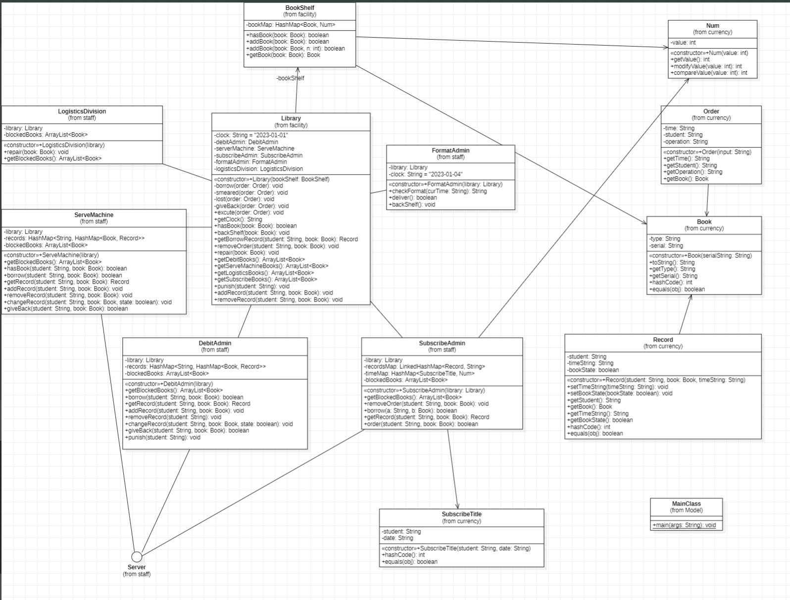
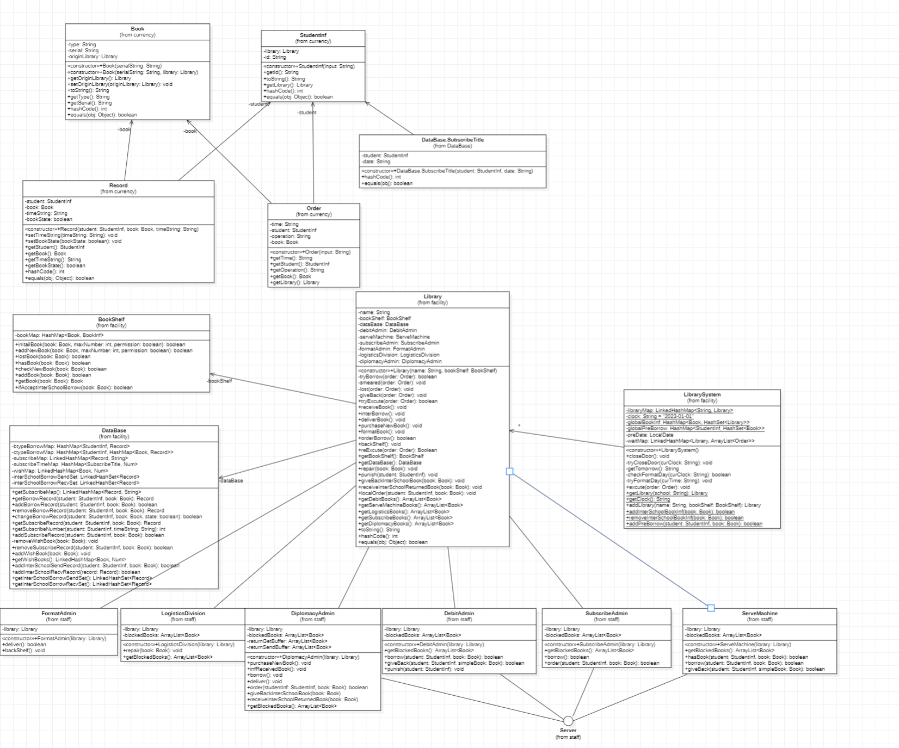

# Unit4 Library(respect)

## 前言

本单元是本来是典型的抽象事务关系设计架构的单元，但是hw15憋了个大的，直接憋成猜测课程组架构并进行 ~~设计~~

具体题目在 `面向对象设计与构造第十五次作业.md`
背景是图书馆借书，涵盖 预约数目、不同方式借书、归还、逾时归还乘法、购书、校级运输

测试我放 test.ps1 脚本了，准备了一些数据便于验证系统结果正确性

## 总结本单元所实践的正向建模与开发

本单元正向建模过程较为曲折，在hw13时经历了两版uml后我发现细节无法处理于是都重构了。在绘制第三版时，先将分离于题面、评论区、微信群的需求统合起来，没说明的情况就自己脑补出来，这是第一步(耗时最长的一步)。
第二步是，划分出大致的类和每个类的职责，并将执行职责的行为方法，相关成员字段设计好，高重合的部分就抽象出 `interface`(我原以为本单元图测评强制要求出现 `interface`)，最后把这个框架画到 `classuml`上。
第三步照着这个架构实现代码，这时候会遇到一些细节问题导致框架的修改，但是基本都是添加,~~如果出现大面积删除或者修改，那就是第二步做的比较烂~~
第四步是修正 `classuml`, 使其能通过图评测

## 总结本单元作业的架构设计

hw13和hw14、hw15架构基本相同，不过hw13是将记录分散于各个管理员手中，从hw14起新建数据库类对借阅信息进行管理，并达到类似管理员之间记录联网的效果。

以下直接立足hw15进行架构说明

数据:

- 书籍: 物理意义上的书籍，只记录书的名字和所属图书馆
- 记录: 记录借阅信息，包括书本、学生、时间、状态
  架构从模拟实际出发，书本自身不具备丢失和损坏状态，现实中丢失和损坏也并不会给出，只有在归还时才能发现，这里做一个改变，将借出书籍状态计入记录，损坏对应修改状态，丢失直接删记录

设施:

- 图书管理系统: 管理时钟，并且判定开馆，闭馆以及整理日的到来，拥有一个图书馆表和全系统允许跨校区借阅图书的信息表
- 图书馆: 协调管理员，拥有一个书架和一个数据库，负责指令解析执行以及支持管理员之间的交流
- 数据库: 为每个图书馆所私有，赋值 查、删、增 借阅和预订信息
- 书架: 管理书籍，判定书籍如今有无，有过没有

员工:

~~职责都在题中，很容易确认，此外~~每个员工(除了整理管理员外)都有一个阻塞书队列，等待整理日时进行回收借出或者上架

下附三张uml图

hw13:

hw14:

hw15:
与hw14几乎一致，因为题目要求强制改了两个方法名

## 对比分析最终的代码设计和UML模型设计之间的追踪关系

类名最后都是手敲的，并将代码中有的都画在图上了，uml和我的代码是相互指导的，所以一致性应该是很高的(为了通过测试必须用代码指导类图)

## 总结自己在四个单元中架构设计思维的演进

架构设计思维从之前的 封装经验 趋向 功能划分、分工细小、数据与行为分离等方向，突出的就是一个建模思想的增强。
除了Unit3中架构设计不是自己做的，几乎每一单元我都会在第二次作业进行小重构，主要是猜测第三次迭代方向(除了Unit4捉摸不透，Unit1、Unit2都猜得八九不离十)，将自己目前的设计思路进行整理和划分，将耦合度降下来，并使得架构更清晰，更便于第三次迭代(没有任何一个单元在第三次重构了一丁点，也是达到了一些预期)

## 总结自己在四个单元中测试思维的演进

最开始是无规则的数据对拍，后来逐步学习测试方法，学会了:

1. 将上次强测拷下来跑做回归测试
2. 增加不规则输入和超越课程组数据规模的数据测试
3. 在Unit2尝试生成攻击特定点数据
4. 单元测试，Unit3在错了第一次作业的OKtest(原因是ValueSet写成KeySet)后，知道对一些不确信的版块进行单元测试

## 总结自己的课程收获

1. 进一步积累了编码经验
2. 学会了一些架构的方法(重点)
3. 学会忍受用户无理取闹的需求
4. 学到了一些面向对象的思维方法
5. 坚持了一些个人追求~~(课程要求本质还是做一个玩具，看看Unit1的数据要求就知道了，一些同学的代码根本无法支持日常小数据的使用)~~
